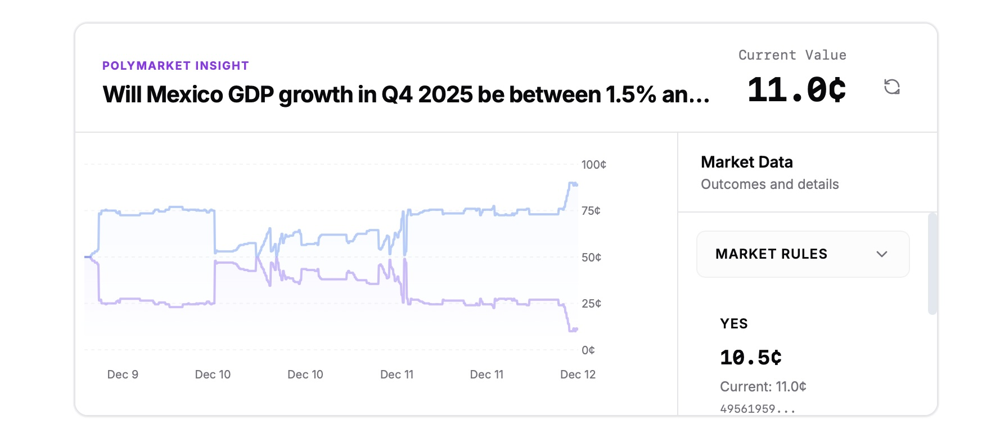
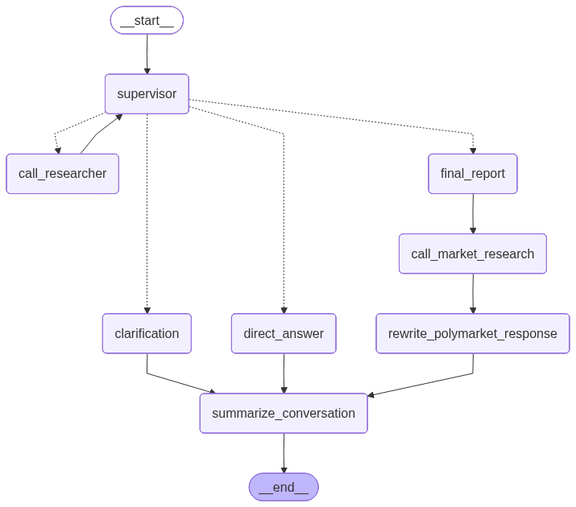

# PolyPlexity



PolyPlexity is your research assistant—if your research assistant always talked about Polymarket. 

Powered by LangGraph multi-agent architecture, PolyPlexity conducts comprehensive research on any topic you ask about, then automatically augments that research with relevant Polymarket prediction market data. The system uses intelligent agents to search the web, synthesize findings, identify related prediction markets, and provide you with both research insights and market context—all in real-time.

## How It Works

When you ask a question, PolyPlexity's supervisor agent orchestrates a multi-step research process:

1. **Research Phase**: A dedicated researcher agent searches the web, gathers sources, and synthesizes information about your topic
2. **Market Discovery**: A market research agent analyzes the research findings and identifies relevant Polymarket prediction markets
3. **Augmentation**: The system combines research insights with market data, price history, and market recommendations
4. **Delivery**: You receive a comprehensive answer with sources, reasoning, and interactive Polymarket charts—all streamed in real-time

The entire process is transparent: you can see the AI's reasoning, track sources as they're discovered, and explore market data through interactive price history visualizations.

## Table of Contents

- [How It Works](#how-it-works)
- [Features](#features)
- [Architecture](#architecture)
- [Prerequisites](#prerequisites)
  - [Frontend Prerequisites](#frontend-prerequisites)
  - [Backend Prerequisites](#backend-prerequisites)
- [Setup Instructions](#setup-instructions)
  - [Backend Setup](#backend-setup)
  - [Frontend Setup](#frontend-setup)
- [LangGraph Agent Architecture](#langgraph-agent-architecture)
- [Running the Application](#running-the-application)
- [Environment Variables](#environment-variables)
  - [Backend Environment Variables](#backend-environment-variables)
  - [Frontend Environment Variables](#frontend-environment-variables)
- [Testing](#testing)
  - [Backend Tests](#backend-tests)
- [Development](#development)

## Features

- **AI-Powered Research**: LangGraph-based multi-agent system for comprehensive research using web search and synthesis
- **Web Search Integration**: Real-time web search using Tavily API with automatic source extraction and citation
- **Polymarket Market Discovery**: Automatically finds relevant prediction markets based on research topics using intelligent tag matching
- **Price History Charts**: Interactive price history visualizations for Polymarket markets with hover interactions and outcome selection
- **Real-Time Streaming**: Server-Sent Events (SSE) for live updates during research, showing reasoning and sources as they're discovered
- **Reasoning Transparency**: View the AI's thought process and reasoning steps in real-time through collapsible reasoning accordions
- **Source Citations**: Automatic source extraction and citation from web research with clickable links and domain extraction
- **Thread Persistence**: Conversation history saved and retrievable across sessions with PostgreSQL backend
- **Market Recommendations**: Context-aware Polymarket market suggestions with explanations and blurb generation
- **Multi-Agent Architecture**: Supervisor orchestrates researcher and market research subgraphs for efficient task delegation

## Architecture

- **Frontend**: React + TypeScript application built with Vite
- **Backend**: FastAPI application with LangGraph agent for AI research and market analysis

## Prerequisites

### Frontend Prerequisites

- **Node.js** (v18 or higher recommended)
- **npm** (comes bundled with Node.js)
- **Vite** - The frontend uses Vite as the build tool. See [Vite documentation](https://vitejs.dev/guide/) for more information.

### Backend Prerequisites

- **Python** 3.12 
- **uv** - Fast Python package installer and resolver. Install with:
  ```bash
  curl -LsSf https://astral.sh/uv/install.sh | sh
  ```
  See [uv documentation](https://docs.astral.sh/uv/getting-started/installation/) for more installation options.

## Setup Instructions

### Backend Setup

1. Navigate to the backend directory:
   ```bash
   cd backend
   ```

2. Create a virtual environment using uv:
   ```bash
   uv venv
   source venv/bin/activate  # On Windows: venv\Scripts\activate
   ```

3. Install the polyplexity_agent package in editable mode:
   ```bash
   cd polyplexity_agent
   pip install -e .
   cd ..
   ```

4. Install backend dependencies:
   ```bash
   pip install -r requirements.txt
   ```

5. Run the backend server:
   ```bash
   uvicorn main:app --reload
   ```

   The backend will start on `http://localhost:8000`

### Frontend Setup

1. Navigate to the frontend directory:
   ```bash
   cd frontend
   ```

2. Install frontend dependencies:
   ```bash
   npm install
   ```

3. Start the development server:
   ```bash
   npm run dev
   ```

   The frontend will start on `http://localhost:3000`

## LangGraph Agent Architecture

PolyPlexity uses a sophisticated LangGraph-based multi-agent system where a supervisor agent orchestrates specialized subgraphs:

- **Supervisor Node**: Routes queries to appropriate subgraphs and makes decisions about when research is complete
- **Researcher Subgraph**: Handles web search, query generation, and research synthesis
- **Market Research Subgraph**: Identifies relevant Polymarket markets, evaluates market relevance, and generates market recommendations



The graph visualization above shows the complete agent workflow, including decision points, subgraph calls, and state management. Each node represents a specific capability, and edges show the flow of control and data through the system.

## Running the Application

1. **Start the backend server first** (in one terminal):
   ```bash
   cd backend
   uvicorn main:app --reload
   ```

2. **Start the frontend development server** (in another terminal):
   ```bash
   cd frontend
   npm run dev
   ```

3. **Access the application**:
   - Open your browser and navigate to `http://localhost:3000`
   - The frontend will communicate with the backend API at `http://localhost:8000`

## Environment Variables

### Backend Environment Variables

The backend requires the following environment variables. See `backend/.env.example` for a template:

- **TAVILY_API_KEY** - Tavily API key for web search functionality
- **GROQ_API_KEY** - Groq API key for LLM models
- **POSTGRES_CONNECTION_STRING** - PostgreSQL connection string for database persistence (optional)

Create a `.env` file in the `backend/` directory based on `.env.example` and fill in your credentials. The creator can supply all credentials or just a raw `.env` file.

### Frontend Environment Variables

The frontend uses environment variables for configuration. The default backend API URL is `http://localhost:8000`. You can override this by setting the `VITE_API_URL` environment variable.

## Testing

### Backend Tests

To run the backend unit tests:

```bash
cd backend/tests
pytest
```

This will run all unit tests for the backend. For more detailed testing information, see the [tests README](backend/tests/README.md).

## Development

- Frontend runs on port **3000** (configurable in `vite.config.ts`)
- Backend API runs on port **8000** (configurable in `main.py`)
- CORS is configured to allow requests from `http://localhost:3000`
